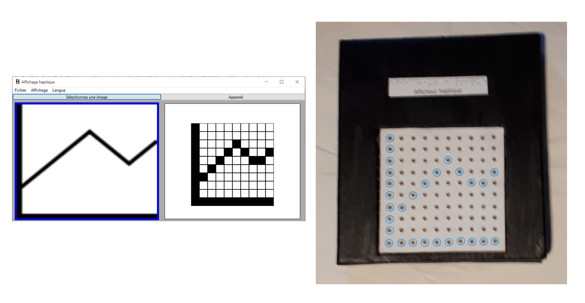

haptic-display
==============

A haptic display prototype for displaying tactile graphics

*Haptic* or *tactile* displays are designed to make images accessible for
visually impaired people. A surface acts as a screen whose elements can be
elevated or lowered to compose pictures accessible through touch.

High prices make this technology unaffordable to many consumers. This project
demonstrates a haptic display prototype with a low manufacturing cost
(inferior to 100 Canadian dollars) that achieves a ten by ten pixel resolution.

   Use case of the haptic display. The GUI (left) is used to select an image
   and adapt it to the display's resolution. The device (right) displays the
   image - picture elements in high position are highlighted with blue circles.

Project Components
------------------

The project comprises a *device* that displays images and a
*software application* used to upload images to the device. More precisely,

- The device is made of three modules:

  - A *mechanism* controlled with electrical motors manipulates the position
    of picture elements on the display.
  - An *electrical circuit* controls the rotation of motors through H-bridges.
    The circuit plans are available in the "device" directory.
  - An *embedded program* executed on a microcontroller controls power supply

- The application contains two main modules:

  - A graphical user interface, fully accessible with a keyboard and
    compatible with screen readers, is used to select images.
  - An OpenCV-based image manipulation script modifies images to adapt them
    to the display's resolution

Running the Application
-----------------------

The software application is multi-platform and can be used on any system that
support Python, WxWidgets and OpenCV. To run it, go the the
"haptic-display/application" directory, install all required
components (in a virtual environment, preferably) and launch the script
"haptic.py". On Windows,

.. code-block::

   py -m venv venv
   venv\Scripts\activate
   pip install -r application\requirements.txt
   py application/haptic.py

On UNIX,

.. code-block::

   python3 -m venv venv
   source venv/bin/activate
   pip install -r application/requirements.txt
   py application/haptic.py
